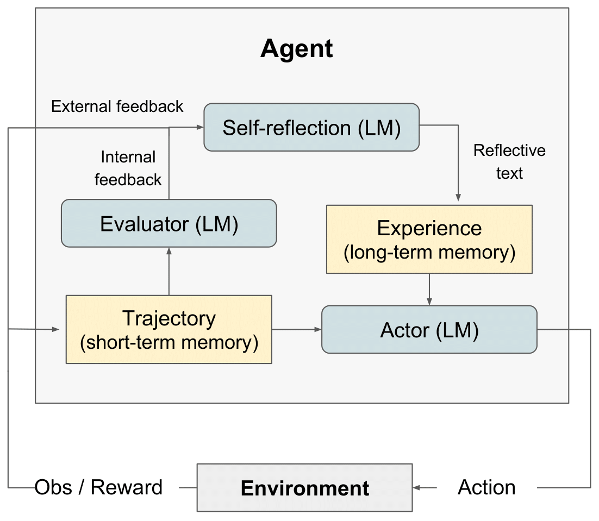

# LLM Agent with Reforcement Learning

<p align="center"></p>

Large language models (LLMs) have been increasingly used to interact with external environments (e.g., games, compilers, APIs) as goal-driven agents. However,
it remains challenging for these language agents to quickly and efficiently learn
from trial-and-error as traditional reinforcement learning methods require extensive training samples and expensive model fine-tuning. We propose reinAgent, a
novel framework to reinforce language agents not by updating weights, but instead through linguistic feedback. Concretely, reinAgent agents verbally reflect
on task feedback signals, then maintain their own reflective text in an episodic
memory buffer to induce better decision-making in subsequent trials. reinAgent is
flexible enough to incorporate various types (scalar values or free-form language)
and sources (external or internally simulated) of feedback signals, and obtains
significant improvements over a baseline agent across diverse tasks (sequential
decision-making, coding, language reasoning). For example, reinAgent achieves a
91% pass@1 accuracy on the HumanEval coding benchmark, surpassing the previous state-of-the-art GPT-4 that achieves 80%. We also conduct ablation and analysis
studies using different feedback signals, feedback incorporation methods, and agent
types, and provide insights into how they affect performance. W

---

## setup

To get started:

1. Clone this repo and move to the HotPotQA directory:

```
git clone https://github.com/ReinAgent/ReinAI && cd ./ReinAI
```

2. Install the module dependencies into your environment:

```
pip install -r requirements.txt
```

3. Set OPENAI_API_KEY environment variable to your OpenAI API key:

```
export OPENAI_API_KEY=<your key>
```

## Agent Types

Agent type is determined by the notebook you choose to run. The available agent types include:

ReinAgent - Rein Agent

CoT_context - CoT Agent given supporting context about the question

CoT_no_context - CoT Agent given no supporting context about the question

The notebook for each agent type is located in the ./hotpot_runs/notebooks directory.

Strategies
Each notebook allows you to specify the reinAgent strategy to be used by the agents. The available reinAgent strategies, which are defined in an Enum, include:

reinAgentStrategy.NONE - The agent is not given any information about its last attempt.

reinAgentStrategy.LAST_ATTEMPT - The agent is given its reasoning trace from its last attempt on the question as context.

reinAgentStrategy.reinAgent - The agent is given its self-reflection on the last attempt as context.

reinAgentStrategy.LAST_ATTEMPT_AND_reinAgent - The agent is given both its reasoning trace and self-reflection on the last attempt as context.

To Run: decision-making (AlfWorld)
Clone this repo and move to the AlfWorld directory

```
git clone https://github.com/ReinAgent/ReinAI && cd ./ReinAI/src
```

Specify the run parameters in ./run_reinagent.sh. **num_trials**: number of iterative learning steps **num_envs**: number of task-environment pairs per trial **run_name**: the name for this run **use_memory**: use persisting memory to store self-reflections (turn off to run a baseline run) **is_resume**: use logging directory to resume a previous run **resume_dir**: the logging directory from which to resume the previous run **start_trial_num**: if resume run, then the trial number of which to start